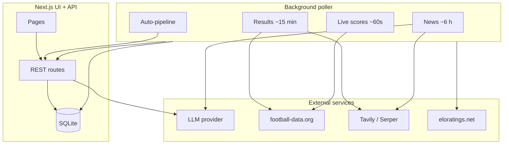
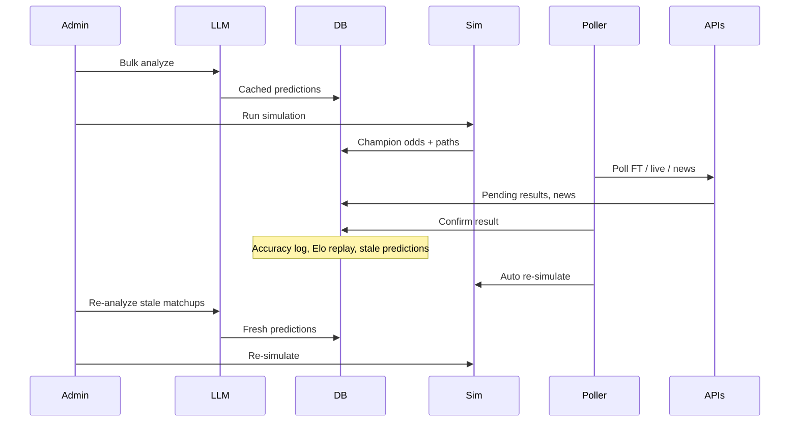

# Architecture & data flow

How World Cup Odds works end to end: predictions, simulation, results, Elo, accuracy, and the background poller.

## What the app does

World Cup Odds is an **odds calculator** for the 2026 FIFA World Cup — not a betting product. The core loop:

1. **Predict** match win/draw/loss probabilities (primarily via LLM)
2. **Simulate** the tournament thousands of times (Monte Carlo)
3. **Display** champion odds, bracket paths, and group projections
4. **Ingest** real results and squad news as the tournament progresses
5. **Refresh** predictions and simulation when reality changes

All durable state lives in **SQLite** (`DATABASE_PATH`, default `./data/worldcup.db`). On Railway, mount a volume at `/data` so data survives redeploys.

## System overview

**Production** runs Next.js and the poller in one process: `npm start` → `concurrently` with `next start` and `npm run poller`. See [RAILWAY.md](./RAILWAY.md).

## Static tournament data

Bundled JSON under `data/` defines:

- 48 teams (FIFA rank, confederation)
- 72 group fixtures
- Full knockout bracket template (R32 → final)
- World Football Elo seeds (`world-football-elo.json`)

Knockout slots start as `TBD` until results determine qualifiers.

### Resolved matches

`lib/data/resolved.ts` overlays **confirmed results** onto the static bracket via `getResolvedMatches()`:

- Group fixtures keep fixed teams
- Knockout matchups get real `homeTeamId` / `awayTeamId` once earlier rounds finish
- Match pages, poller, analysis, and simulation all use this layer

## Predictions (LLM layer)

### Output

For each team pairing and stage, the LLM returns JSON with:

- `homeWinPct`, `drawPct`, `awayWinPct` (0–100, sum to 100)
- `keyFactors`, `analysis`
- `predictedScore` (display only; simulation uses probabilities)

Implementation: `lib/ai/analyze-pairing.ts` (shared core), called by `analyze-match.ts` and `analyze-pair.ts`.

### When the LLM runs

| Trigger | Entry point | Notes |
|---------|-------------|-------|
| **Bulk analyze** | `POST /api/analyze/bulk` | Main path; ~348+ matchups; requires `ADMIN_PIN` |
| **Auto analyze** | Poller → HTTP bulk | Only if `AUTO_ANALYZE_MISSING=1` |
| **Single match** | `POST /api/analyze/match` | Match page; rate-limited; `maxAttempts: 1` |
| **Team news** | `lib/jobs/poll-news.ts` | Extracts injuries/suspensions from search snippets |
| **Score extraction** | `lib/jobs/poll-results.ts` | Last resort when no scores API; regex-first, then LLM |

### Bulk analyze queue

Built by `lib/ai/preanalyze.ts`:

1. Unplayed **group fixtures** with known teams (72)
2. **Top-24 × top-24** knockout pairings precached as stage `knockout` (276)
3. **Gap-fill** — any pairings the Monte Carlo simulator still needs for plausible bracket paths

Predictions are cached in SQLite keyed by `(sorted teams, stage, provider, model)` with a `source` column (`llm` | `elo_seed` | `elo_fallback`) and `stale` flag. Cache is reused unless `stale`, TTL-expired, or `refresh: true`. TTL: `PREDICTION_CACHE_TTL_DAYS` (default 7).

### Unified read path (`lib/predictions/`)

All UI surfaces that show fixture win % use the same tiered lookup:

1. **Fresh** — non-stale, non-expired cached row
2. **Stale** — `stale=1` or expired LLM row (still used for sim + display until re-analyzed)
3. **Elo fallback** — in-memory knockout-only estimate when no DB row exists

`resolveFixtureProbabilities()` applies news impact (kickoff-scaled) and powers the match page, groups table, and analyze GET. Simulation and bracket advance % use `loadPredictionStore()`, which calls the same `lookupPredictionTiered()` core.

`analyze-pairing` returns cached fresh **or stale** rows without an LLM call; `refresh: true` or missing cache triggers the model.

### Prompt contents

`lib/ai/prompts.ts` + `lib/ai/build-context.ts`:

- Fixture details (teams, stage, venue, date)
- **World Football Elo** (eloratings.net) — primary strength signal
- **Tournament Elo** — when confirmed results have moved in-app ratings
- **Learning context** — recent results for each team + worst past prediction misses from `prediction_log`
- Knockout rules: no draws; split 100% between home/away (includes ET/pens)

**Squad news is excluded from the LLM prompt.** News adjusts displayed probabilities on read (`lib/news/impact.ts`) so odds update without re-running the model.

### Without an LLM

If `ELO_SEED_MISSING=1` (default), **true gaps** (no fresh/stale/expired LLM row) are filled from **tournament Elo** probabilities (`lib/calibration/seed-elo-predictions.ts`). Auto-pipeline uses `allowOverwrite: false` so stale or expired LLM rows are **never** replaced by Elo seeds. Manual full reseed (`reseedPredictionsAndSimulate`) and `ELO_RESEED_PREDICTIONS` opt in to overwrite; the `scripts/seed-elo-predictions.ts` CLI skips protected rows unless `FORCE=1`.

### LLM observability

Every `completeJSON` call logs structured lines: `[llm] provider=… ok=… durationMs=…`. Bulk runs log `[llm:bulk] status=… analyzed=… failed=… durationMs=…` including on cancel. See `lib/ai/llm-log.ts`.

## News impact

The poller refreshes squad news for teams with a kickoff in the next **48 hours** (TTL: 6 h normally, 2 h on matchday).

1. Web search (Tavily/Serper) → snippets
2. LLM extraction → structured events (injury, suspension, return, etc.) in `lib/news/store.ts`
3. On display, `fixtureProbabilitiesWithNews()` applies deterministic **Elo-equivalent deltas** per event, scaled by days until kickoff (`NEWS_IMPACT_FIXTURE_DAYS`, default 14)

Disable with `NEWS_IMPACT_ENABLED=false`.

## Tournament simulation

Triggered manually (`POST /api/analyze/tournament`, `ADMIN_PIN`) or by the auto-pipeline.

### Algorithm (`lib/simulator.ts`, `lib/sim/run-tournament.ts`)

1. Load **prediction store** for the active LLM provider (`lib/sim/prediction-store.ts`)
2. Fail if **missing pairings** remain (`lib/sim/gap-analysis.ts`)
3. Run **Monte Carlo** (`SIMULATION_ITERATIONS`, default 5000) with fixed RNG seed
4. Each iteration:
   - Play group stage — **confirmed results are locked**; unplayed games sampled from probabilities
   - Rank groups, select third-place qualifiers (FIFA tiebreak rules)
   - Resolve knockout bracket — sample winners (no draws in knockout)
5. Aggregate champion odds, survival odds, representative predicted path, sanity alerts

Output is cached in `simulation_cache`. The UI reads cache; simulation does **not** call the LLM during iterations. Rare bracket paths without a cached prediction use an Elo fallback (`lib/sim/rank-fallback-prediction.ts`).

## Results pipeline

### Final scores (poller, ~every 15 min when matches need FT)

Provider chain (`lib/jobs/poll-results.ts`):

1. **football-data.org** — `FINISHED` matches (`FOOTBALL_DATA_API_TOKEN`)
2. **Web search** — regex + 2-snippet agreement first; LLM extraction if ambiguous (`TAVILY_API_KEY` or `SERPER_API_KEY`)

Scores are stored as **pending** until confirmed.

### Confirmation

- Structured APIs auto-confirm reliable `FINISHED` results
- Admin: `POST /api/results/[matchId]/confirm` with `{ "pin": "…" }`

### Live scores

football-data.org `LIVE`/`IN_PLAY` every ~60 s while matches are in the kickoff window. Cached in SQLite; UI reads `/api/live/scores`.

### On every confirmation (`lib/results/on-confirm.ts`)

| Hook | Effect |
|------|--------|
| `logPredictionAccuracy` | Scores pre-match pick vs actual → `prediction_log` |
| `updateEloForMatch` | Recomputes tournament Elo from all confirmed results |
| `markTeamsStale` | Marks cached predictions for both teams `stale=1` |
| `scheduleAutoSimulation` | Debounced re-sim if auto-pipeline enabled |

**Unconfirm** (`finalizeResultUnconfirmation`): replays Elo without the match, deletes the accuracy log row, clears `stale` on that fixture’s prediction row (sibling pairings involving the same teams may remain stale), and schedules re-sim.

## Elo — two systems

### World Football Elo (external prior)

- Source: [eloratings.net](https://eloratings.net) — bundled JSON + optional live fetch
- **Updated by:** poller startup (`refreshWorldFootballEloOnStartup`, `ELO_REFRESH_ON_START`)
- **Used for:** LLM prompt baseline, Elo-seed predictions, initial seeds for tournament Elo replay
- **Not** incremented per match in SQLite

### Tournament Elo (in-app)

- Table: `elo_ratings` — `lib/calibration/elo.ts`
- **Updated by:** `recomputeEloFromConfirmedResults()` — full replay of every confirmed match in kickoff order, seeded from World Football Elo
- **Triggered by:** result confirmation, poller startup (after external refresh), `lib/calibration/reseed-elo.ts`
- K-factor: 32 (group), 40 (knockout)
- **Used for:** “Tournament Elo (after confirmed results)” in LLM prompts and match-page display

News “Elo delta” on probabilities is separate from `elo_ratings` — it only shifts displayed win %.

## Accuracy feature

### Measurement

After each confirm, `logPredictionAccuracy` (`lib/calibration/metrics.ts`) writes to `prediction_log`:

- Predicted probabilities (news-adjusted, with AI baseline stored for comparison)
- Actual outcome (home / draw / away)
- Brier score, log loss, direction correct

The `/accuracy` page and `GET /api/accuracy` aggregate: pick accuracy %, calibration bins, biggest surprises, news vs baseline Brier.

### How it improves future predictions

Accuracy does **not** auto-calibrate probability math. It feeds back indirectly:

1. **Learning context** — worst past misses injected into LLM prompts for teams involved
2. **Tournament Elo** — confirmed results update ratings used in prompts
3. **Stale predictions** — confirm marks teams stale → next bulk analyze re-runs LLM with fresh context
4. **News validation** — accuracy page shows whether news adjustments help (tune `NEWS_IMPACT_*` env vars)

The `isCalibrated` column on predictions exists but is not yet used in the learning loop.

## Auto-pipeline

`lib/pipeline/auto-pipeline.ts` — runs in the poller process.

| Env var | Default | Effect |
|---------|---------|--------|
| `AUTO_PIPELINE_ENABLED` | `1` | Master switch |
| `AUTO_SIMULATE_ON_RESULTS` | `1` | Re-simulate after confirmed results (5 s debounce) |
| `AUTO_PIPELINE_ON_START` | `1` | On boot: sim if missing/stale; optional gap-fill |
| `AUTO_ANALYZE_MISSING` | `0` | Bulk LLM analyze when simulation has gaps |
| `AUTO_REANALYZE_STALE` | `0` | Re-analyze stale LLM rows before auto-sim |
| `ELO_SEED_MISSING` | `1` | Tournament Elo-fill for true gaps only (never overwrites stale/expired LLM) |

**Auto-sim order** (after result confirm or on startup via `enqueuePipelineRun`): optional stale re-analyze → optional gap analyze → Elo seed true gaps (confirmed fixtures excluded) → simulate.

`GET /api/tournament/status` includes `predictionCoverage` (fresh / stale / elo_seed / missing counts for unplayed group fixtures).

After **bulk analyze** completes, auto-sim is always scheduled (not gated on `AUTO_SIMULATE_ON_RESULTS`).

Poller triggers bulk analyze (gap-fill and stale re-analyze) via HTTP to `APP_URL/api/analyze/bulk` so in-memory job state stays in the Next.js process. Stale re-analyze uses `{ stale: true }` on the same endpoint.

## UI pages

| Route | Primary data |
|-------|----------------|
| `/` | Dashboard — fixtures, champion preview, bulk/sim controls, pipeline status |
| `/groups` | Official + projected standings, fixture win % |
| `/bracket` | Official path vs simulated paths (consensus, leader, random sample) |
| `/champion` | Champion %, survival odds, base (AI without news) vs current (with news) |
| `/accuracy` | Track record vs confirmed results |
| `/match/[id]` | Live status, AI prediction, squad news, Elo, confirmed score |

## Typical lifecycle

## Key source files

| Area | Location |
|------|----------|
| LLM providers | `lib/ai/` |
| Prediction cache | `lib/ai/predictions.ts`, `lib/predictions/lookup.ts`, `lib/predictions/resolve-fixture-probs.ts` |
| Simulation | `lib/simulator.ts`, `lib/sim/` |
| Results | `lib/jobs/poll-results.ts`, `lib/results/` |
| News | `lib/jobs/poll-news.ts`, `lib/news/` |
| Elo | `lib/calibration/elo.ts`, `lib/calibration/world-football-elo.ts` |
| Accuracy | `lib/calibration/metrics.ts` |
| Auto-pipeline | `lib/pipeline/` |
| Poller entry | `scripts/poller.ts` |
| DB schema | `lib/db/schema.ts` |

## Related docs

- [LOCAL_LLM_GUIDE.md](./LOCAL_LLM_GUIDE.md) — vLLM on H100, bulk analyze tuning
- [RAILWAY.md](./RAILWAY.md) — production deploy, env vars, volume setup
